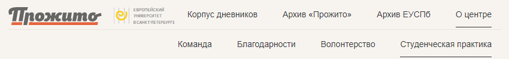

# [Prozhito project](https://prozhito.org/) React components UI library

## Installation:

`npm install https://github.com/prozhito/lib --save`

## Usage:

### `ProzhitoHeader`

[](#ProzhitoHeader)

- Importable `Header` ui component with its own logo images (SSR).
- Header menu with mobile version and menu content fetcher (SSR).

```tsx
import { ProzhitoHeader } from '@prozhito/lib'

function MyApp() {
  return <ProzhitoHeader />
}

export default MyApp
```

### `ProzhitoHeader` with account

[](#ProzhitoHeader)

- Optional user menu button (CSR).
- `Account` class (some sort of custom state manager).
- Secure auto auth with token or refresh token (SSR).
- Account modal with ability to login/logout/view user info (CSR).
- Importable `useUser` hook, that provides access to user info.

```tsx
import { ProzhitoHeader } from '@prozhito/lib'

function MyApp() {
  return <ProzhitoHeader account={true} />
}

export default MyApp
```
